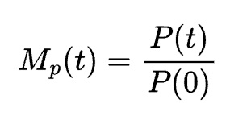

# crypto-dashboard

## Description

CryptoDash is a tool for monitoring cryptocurrency price movements on Binance. Users can select any tradable tokens listed on Binance and various statistical indicators to analyze.

## Table of Contents

- [Installation](#installation)
- [Features](#features)
- [Usage](#usage)
- [Technologies](#technologies)
- [Contact](#contact)

## Installation

## Features

1. **Token Selection**: Upon signing up and logging in, users are provided with a list of all tokens that can be traded on Binance.

2. **Timeframe Selection**: Users can select their preferred timeframe to analyze the token's performance.

3. **Window Length for Statistical Indicators**: Users can select the window length for which they want the statistical indicators to be calculated.

4. **Statistical Indicators**: Once the tokens have been chosen, users are guided to a screen where they can choose various statistical indicators, including:

   - **Multiple of Price**:
   
   <figure>
    
    </figure>
   
   - **Multiple of Volume**:
      
   <figure>
    
    </figure>
     
   - **Multiple of Price Average**:
         
   <figure>
    
    </figure>
     
   - **Multiple of Volume Average**:
         
   <figure>
    
    </figure>
     
   - **Accumulated Rate of Change of Multiple Price**:
         
   <figure>
    
    </figure>
     
   - **Accumulated Rate of Change of Multiple Volume**:
         
   <figure>
    
    </figure>
     

## Usage

## Technologies

## Contact