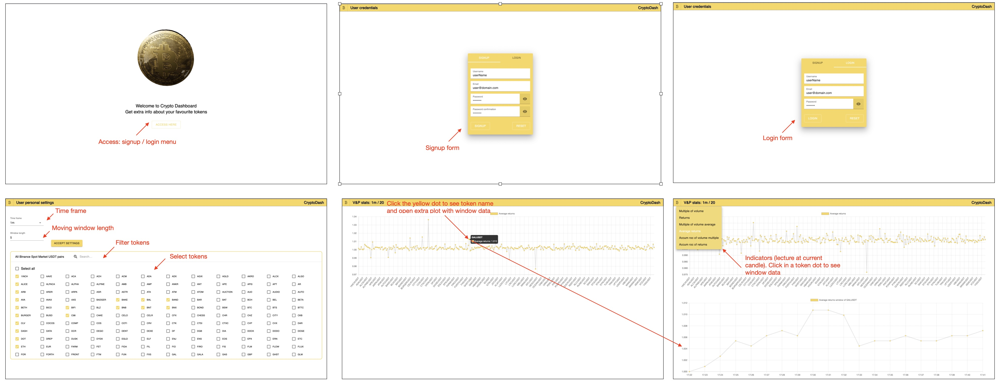

<h1 align="center">Portfolio Use Only</h1>

> :warning: **Important Note**

This repository and its contents, including installation and deployment instructions, are provided for portfolio review and demonstration purposes only. While the repository is publicly viewable and its code can be executed for review purposes, no license is granted for any further use, distribution, or reproduction of the materials contained herein. Any such activities are prohibited without express permission from the repository owner. Please contact the owner for any questions or requests for use.

# crypto-dashboard-frontend

## Description

crypto-dashboard-frontend operates as a tool for monitoring cryptocurrency price movements on Binance. It enables selection of any tradable tokens listed on Binance, with a wide range of statistical indicators available for analysis.

## Table of Contents

- [Installation](#installation)
- [Development](#development)
- [Deployment](#deployment)
- [Features](#features)
- [Usage](#usage)
- [Technologies](#technologies)
- [Contact](#contact)

## Installation

Ensure the following prerequisites are met before proceeding:

- Node.js and npm are installed on the local development machine.
- An AWS account with the necessary permissions is available.
- Github CLI is installed.

### Clone the Repository

The repository should be cloned to the local machine:

```
git clone https://github.com/jparraporcar/crypto-dashboard-frontend.git
```

A new branch should then be created (this step is mandatory for development work as any push to the main branch will trigger the GitHub action for deployment).

```
gh repo checkout -b new-branch-name
```

## Install Dependencies

After navigating to the cloned project's directory:

```
cd crypto-dashboard-frontend
```

The project dependencies should be installed using npm:

```
npm install
```

## Deployment

This project employs a Continuous Deployment (CD) pipeline with AWS. The following steps are required to ensure the frontend is correctly deployed on AWS:

1. **Backend setup:** Firstly, the backend repository can be found at [https://github.com/jparraporcar/crypto-dashboard-backend](https://github.com/jparraporcar/crypto-dashboard-backend). The instructions there should be followed to deploy it correctly.

2. **Defining Endpoints:** Once the backend has been deployed, the endpoints need to be defined in a `.ts` file which should be created in the `/src` directory of this repository (`crypto-dashboard-frontend`).

The 5 endpoints resulting from the backend deployment need to be declared as strings in the following way:

```
export const loginApi='xxx'
export const registerApi='xxx'
export const priceVolumeDataApi='xxx'
export const priceVolumeDataWindowApi='xxx'
export const allSpotTickerNames='xxx'
```

3. **AWS Secrets Configuration:** It is necessary to set the appropriate AWS secrets in the GitHub repository. These secrets should include `AWS_ACCESS_KEY_ID` and `AWS_SECRET_ACCESS_KEY` corresponding to the AWS account.

This project employs GitHub Actions for its CD pipeline. The actions are triggered with each push to the main branch. The workflow, defined in the `.github/workflows/main.yml` file, consists of the following steps:

1. **Setup:** A job is established to run on the latest Ubuntu version, utilizing Node.js version 16.x.

2. **Install Dependencies:** All dependencies are installed using `npm ci`.

3. **Build:** A production build of the application is generated using `npm run build`.

4. **Deploy:** The application is subsequently deployed on AWS via the Serverless Framework. The `serverless-finch` plugin is installed and the frontend is deployed without the need for confirmation. AWS credentials are supplied as secrets.

5. **Website:** In the "Static website hosting" section within AWS S3, the link to the deployed website can be located.

## Features

1. **Token Selection**: Upon completion of signup and login, users are presented with a list of all tokens that are tradable on Binance.

2. **Timeframe Selection**: A preferred timeframe for token performance analysis can be selected by the user.

3. **Window Length for Statistical Indicators**: The window length for the calculation of statistical indicators can be selected by the user.

4. **Statistical Indicators**: Upon selection of the tokens, users are directed to a screen where various statistical indicators can be chosen, including:


- **Moving Multiple of Price**:
    <br />
    <figure>
        
    </figure>
    <br />
    <br />
    <figure>
        
    </figure> 
    <br />
    <br />
- **Moving Multiple of Volume**:
    <br />
    <figure>
        
    </figure>
    <br />
    <br />
    <figure>
        
    </figure> 
    <br />
    <br />
- **Moving Average Multiple of Price**:
    <br />
    <figure>
        
    </figure>
    <br />
    <br />
    <figure>
        
    </figure> 
    <br />
    <br />
- **Moving Average Multiple of Volume**:
    <br />
    <figure>
        
    </figure>
    <br />
    <br />
    <figure>
        
    </figure> 
    <br />
    <br />
- **Moving Accumulated Rate of Change of Multiple Price**:
    <br />
    <figure>
        
    </figure>
    <figure>
        
    </figure> 
    <br />
    <br />
- **Moving Accumulated Rate of Change of Multiple Volume**:
    <br />
    <figure>
        
    </figure>
    <br />
    <figure>
        
    </figure> 
   <br />
   <br />

## Usage

   <br />
    <figure>
        
    </figure> 
   <br />

### Technologies

The CryptoDash application leverages several libraries and frameworks to build an effective, dynamic, and interactive user interface. Below are the main technologies used:

- **ReactJS**: A JavaScript library for building user interfaces. React allows developers to create large web applications that can change data, without reloading the page.

- **Redux Toolkit**: The official, opinionated, batteries-included toolset for efficient Redux development. It is used for state management in the application.

- **TypeScript**: A strict syntactical superset of JavaScript, which adds static typing. This helps to write safer and more readable code, making it easier to maintain.

- **Emotion**: A powerful library for writing CSS in JavaScript. It helps to style components in a more modular and maintainable way.

- **Material UI**: A popular React UI framework with a set of React components that implement Google's Material Design.

- **Axios**: A promise-based HTTP client for the browser and Node.js. It simplifies the process of making asynchronous HTTP requests from the client to the server.

- **React Hook Form**: A performant, flexible and extensible forms library with easy-to-use validation.

- **React-Router-Dom**: A dynamic, client-side routing library for React, allowing the application to maintain the seamless user experience of a single page application.

- **React Three Fiber and Drei**: Libraries that bring React's component model to Three.js, a cross-browser JavaScript library used to create and display animated 3D computer graphics on a Web browser.

- **Chart.js and React-Chartjs-2**: Charting libraries that help in the visual representation of data in form of charts.

- **Mathjs**: An extensive math library for JavaScript and Node.js. It provides a flexible and user-friendly interface for all kinds of mathematical operations.

- **JWT Decode**: A library to decode JSON Web Tokens (JWT) in JavaScript.

- **Zod**: A TypeScript-first schema declaration and validation library.

- **Serverless and Serverless Finch**: Frameworks for building applications comprised of microservices that helps in deploying AWS lambda functions easily.

- **ESLint and Prettier**: Tools for identifying and reporting on patterns in JavaScript, enhancing code quality and formatting.

Remember to keep your dependencies up to date to have the latest features and security updates.

## Contact

If you want to contact me you can reach me at:

- **Name**: `Jordi Parra Porcar`
- **Email**: `jordiparraporcar@gmail.com`
- **LinkedIn**: [`Jordi Parra Porcar`](https://www.linkedin.com/in/jordiparraporcar/)
