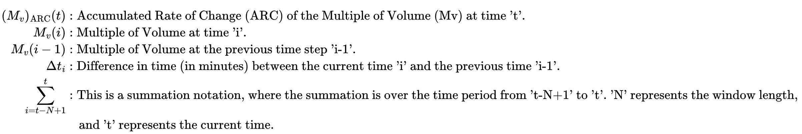

## Description

crypto-dashboard-frontend is a tool for monitoring cryptocurrency price movements on Binance. Users can select any tradable tokens listed on Binance and various statistical indicators to analyze.

## Table of Contents

- [Installation](#installation)
- [Development](#development)
- [Deployment](#deployment)
- [Features](#features)
- [Usage](#usage)
- [Technologies](#technologies)
- [Contact](#contact)

# Installation

Before you start, please make sure you have the following prerequisites:

- Node.js and npm installed on your local development machine.
- AWS account with the necessary permissions.
- Github CLI.

## Clone the Repository

First, clone the repository to your local machine:

```
git clone https://github.com/jparraporcar/crypto-dashboard-frontend.git
```

Then create a new branch (this step is mandatory if you want to work in development since any push to the main branch will trigger the github action for deployment.

```
gh repo checkout -b new-branch-name
```

## Install Dependencies

Navigate to your cloned project's directory:

```
cd crypto-dashboard-frontend
```

Then, install the project dependencies using npm:

```
npm install
```

## Development

For the development stage, you don't need to deploy the application in this repo in AWS for testing. You can run the project in your local machine by executing `npm start` and navigating to [http://localhost:3000](http://localhost:3000).
However you will still need the endpoints coming from the backend deployment as explained in the next section in points 1 and 2.

## Deployment

This project uses a Continuous Deployment (CD) pipeline with AWS. In order to ensure that the frontend is deployed correctly on AWS, you need to follow these steps:

1. **Backend setup:** First. You can find the backend repo at [https://github.com/jparraporcar/crypto-dashboard-backend](https://github.com/jparraporcar/crypto-dashboard-backend). Follow the instructions there to deploy it correctly.

2. **Defining Endpoints:** Once the backend is deployed, you need to define the endpoints in the `env.ts` that you will create in the `/src` directory of this repo (`crypto-dashboard-frontend`).

The 5 endpoints received from the backend deployment must be declared as a strings as follows:

```
export const loginApi='xxx'
export const registerApi='xxx'
export const priceVolumeDataApi='xxx'
export const priceVolumeDataWindowApi='xxx'
export const allSpotTickerNames='''xxx
```

3. **AWS Secrets Configuration:** You need to set the appropriate AWS secrets in your GitHub repository. These secrets should include `AWS_ACCESS_KEY_ID` and `AWS_SECRET_ACCESS_KEY` which correspond to your AWS account.

This project uses GitHub Actions for its CD pipeline. The actions are triggered on each push to the main branch. The workflow is defined in the `.github/workflows/main.yml` file and consists of the following steps:

1. **Setup:** It sets up a job that runs on the latest Ubuntu version and uses Node.js version 16.x.

2. **Install Dependencies:** It installs all the dependencies using `npm ci`.

3. **Build:** It creates a production build of the app using `npm run build`.

4. **Deploy:** Finally, it deploys the application on AWS using Serverless Framework. It installs the `serverless-finch` plugin and deploys the frontend without asking for confirmation. The AWS credentials are provided as secrets.

5. **Website:** Navigate in the "Static website hosting" within the AWS S3 section and find the link to the deployed website

## Features

1. **Token Selection**: Upon signing up and logging in, users are provided with a list of all tokens that can be traded on Binance.

2. **Timeframe Selection**: Users can select their preferred timeframe to analyze the token's performance.

3. **Window Length for Statistical Indicators**: Users can select the window length for which they want the statistical indicators to be calculated.

4. **Statistical Indicators**: Once the tokens have been chosen, users are guided to a screen where they can choose various statistical indicators, including:

- **Moving Multiple of Price**:
    <br />
    <figure>
        
    </figure>
    <br />
    <br />
    <figure>
        
    </figure> 
    <br />
    <br />
- **Moving Multiple of Volume**:
    <br />
    <figure>
        
    </figure>
    <br />
    <br />
    <figure>
        
    </figure> 
    <br />
    <br />
- **Moving Average Multiple of Price**:
    <br />
    <figure>
        
    </figure>
    <br />
    <br />
    <figure>
        
    </figure> 
    <br />
    <br />
- **Moving Average Multiple of Volume**:
    <br />
    <figure>
        
    </figure>
    <br />
    <br />
    <figure>
        
    </figure> 
    <br />
    <br />
- **Moving Accumulated Rate of Change of Multiple Price**:
    <br />
    <figure>
        
    </figure>
    <figure>
        
    </figure> 
    <br />
    <br />
- **Moving Accumulated Rate of Change of Multiple Volume**:
    <br />
    <figure>
        
    </figure>
    <br />
    <figure>
        
    </figure> 
   <br />
   <br />

## Usage

   <br />
    <figure>
        
    </figure> 
   <br />

### Technologies

The CryptoDash application leverages several libraries and frameworks to build an effective, dynamic, and interactive user interface. Below are the main technologies used:

- **ReactJS**: A JavaScript library for building user interfaces. React allows developers to create large web applications that can change data, without reloading the page.

- **Redux Toolkit**: The official, opinionated, batteries-included toolset for efficient Redux development. It is used for state management in the application.

- **TypeScript**: A strict syntactical superset of JavaScript, which adds static typing. This helps to write safer and more readable code, making it easier to maintain.

- **Emotion**: A powerful library for writing CSS in JavaScript. It helps to style components in a more modular and maintainable way.

- **Material UI**: A popular React UI framework with a set of React components that implement Google's Material Design.

- **Axios**: A promise-based HTTP client for the browser and Node.js. It simplifies the process of making asynchronous HTTP requests from the client to the server.

- **React Hook Form**: A performant, flexible and extensible forms library with easy-to-use validation.

- **React-Router-Dom**: A dynamic, client-side routing library for React, allowing the application to maintain the seamless user experience of a single page application.

- **React Three Fiber and Drei**: Libraries that bring React's component model to Three.js, a cross-browser JavaScript library used to create and display animated 3D computer graphics on a Web browser.

- **Chart.js and React-Chartjs-2**: Charting libraries that help in the visual representation of data in form of charts.

- **Mathjs**: An extensive math library for JavaScript and Node.js. It provides a flexible and user-friendly interface for all kinds of mathematical operations.

- **JWT Decode**: A library to decode JSON Web Tokens (JWT) in JavaScript.

- **Zod**: A TypeScript-first schema declaration and validation library.

- **Serverless and Serverless Finch**: Frameworks for building applications comprised of microservices that helps in deploying AWS lambda functions easily.

- **ESLint and Prettier**: Tools for identifying and reporting on patterns in JavaScript, enhancing code quality and formatting.

Remember to keep your dependencies up to date to have the latest features and security updates.

## Contact

If you want to contact me you can reach me at:

- **Name**: `Jordi Parra Porcar`
- **Email**: `jordiparraporcar@gmail.com`
- **LinkedIn**: [`Jordi Parra Porcar`](https://www.linkedin.com/in/jordiparraporcar/)

For any additional questions or comments, please feel free to reach out. Contributions, issues, and feature requests are welcome!
